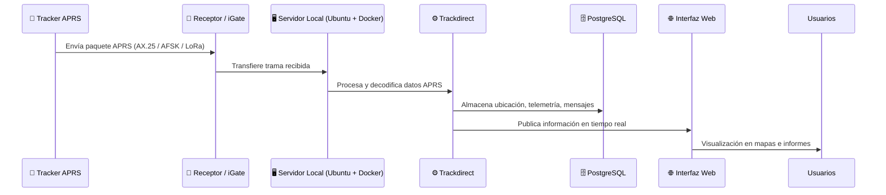
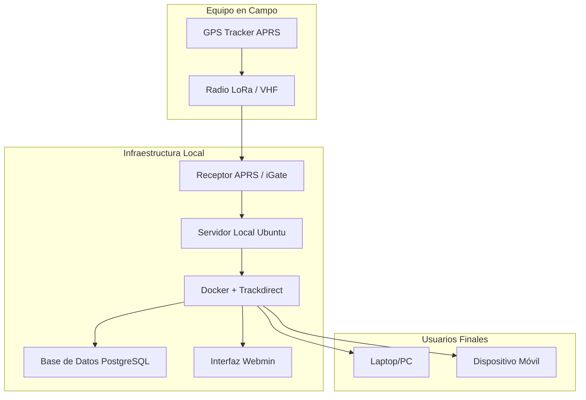
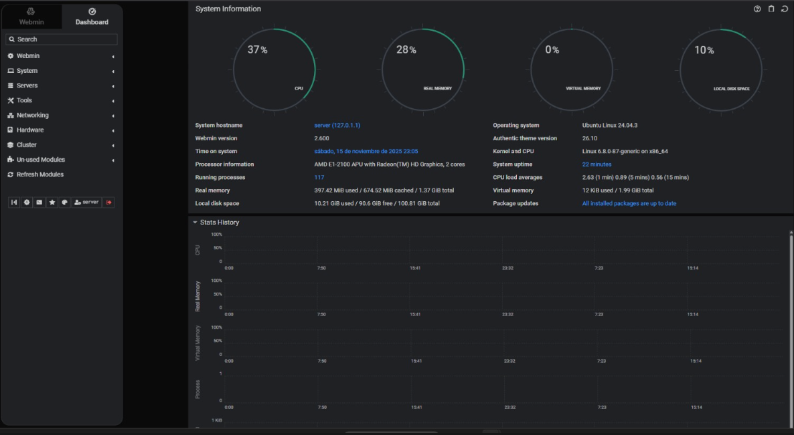

# 📡 Sistema de Monitoreo en Tiempo Real con APRS Trackdirect de equipos de emergencia en incendios forestales  

## Resumen:

Este proyecto implementa un sistema de monitoreo local basado en APRS Trackdirect, diseñado para el seguimiento en tiempo real de equipos de emergencia durante incendios forestales.

El sistema permite operar sin conexión a Internet, utilizando comunicación de radio (LoRa o VHF) y un servidor local desplegado con Docker, lo que garantiza autonomía y resiliencia en zonas remotas.

Incluye una interfaz web para la visualización de posiciones y mensajes APRS, una base de datos PostgreSQL para el almacenamiento de datos y herramientas de administración mediante Webmin.

En este repositorio se documenta la configuración completa del servidor local, la instalación del entorno, y los procedimientos de operación, de manera que el sistema pueda ser replicado y adaptado en futuros despliegues. 

---

## 👥 Integrantes del proyecto

- Lesmes Torres González  
- Patrick Nepveu Nelson  

## 📑 Tabla de Contenidos

1. [Resumen](#-resumen)  
2. [Integrantes del Proyecto](#-integrantes-del-proyecto)  
3. [Fundamentos](#-fundamentos)  
   - [APRS](#-fundamentos-de-aprs)  
   - [LoRa](#-fundamentos-de-lora)  
   - [Legislación en Costa Rica (PNAF)](#-legislación-de-frecuencias-en-costa-rica-pnaf)  
4. [Problemática](#-problemática)  
5. [Objetivos](#-objetivos)  
   - [Objetivo General](#-objetivo-general)  
   - [Objetivos Específicos](#-objetivos-específicos)  
6. [Plan de Trabajo](#-plan-de-trabajo)  
7. [Grupo de Trabajo](#-grupo-de-trabajo)  
8. [Diagrama de Secuencia (Vista Funcional)](#-vista-funcional-diagrama-de-secuencia)  
9. [Arquitectura del Servidor](#-arquitectura-del-servidor)  
10. [Instalación y Configuración del Servidor Virtualizado](#-instalación-y-configuración-del-servidor-virtualizado)  
11. [Instalación y Configuración de APRS Trackdirect](#-instalación-y-configuración-de-aprs-trackdirect)  
12. [Hardware Físico del Servidor](#-hardware-físico-del-servidor)  
13. [Instalación y Configuración del Servidor Físico](#️-instalación-y-configuración-del-servidor-físico)  
14. [Uso del Sistema](#-uso-del-sistema)  
15. [Pruebas y Verificación](#-pruebas-y-verificación)  
16. [Recomendaciones para Fortalecimiento y Escalabilidad](#-recomendaciones-para-fortalecimiento-y-escalabilidad)  
17. [Referencias](#-referencias)


## 📡 Fundamentos  

### Fundamentos de APRS  
**APRS (Automatic Packet Reporting System)** es un protocolo de comunicación digital usado por radioaficionados para transmitir información en tiempo real sobre ubicación, telemetría, mensajes y estado de estaciones.

#### Conceptos Clave

- **Paquetes de Datos:** Transmite información en forma de paquetes digitales, generalmente usando **AX.25**, un protocolo derivado de X.25.
- **Información de Ubicación:** Las estaciones pueden enviar su posición GPS, velocidad, rumbo y altitud, permitiendo su visualización en mapas en tiempo real.
- **Mensajería:** Permite enviar mensajes cortos entre estaciones sin depender de infraestructura centralizada.
- **IGate y Digipeater:**
  - **IGate (Internet Gateway):** Recibe paquetes APRS por radio y los envía a Internet, conectando la red global.
  - **Digipeater:** Repite paquetes APRS para extender el rango de comunicación entre estaciones.

---

### 🔹 Fundamentos de LoRa  
**LoRa (Long Range)** es una tecnología de comunicación inalámbrica de baja potencia diseñada para transmitir datos a largas distancias, ideal para **IoT (Internet of Things)** y aplicaciones de sensores remotos.

#### Conceptos Clave

- **Comunicación de Largo Alcance:** LoRa permite transmitir datos a varios kilómetros en entornos urbanos y decenas de kilómetros en áreas abiertas.
- **Baja Potencia:** Optimizada para dispositivos que funcionan con baterías, con autonomía de meses o incluso años.
- **Modulación Chirp Spread Spectrum (CSS):** La señal utiliza una modulación que es resistente al ruido y a interferencias, manteniendo la integridad de los datos.
- **Topologías de Red:**
  - **Punto a Punto (P2P):** Comunicación directa entre dos dispositivos.
  - **Red LoRaWAN:** Arquitectura de red estándar que permite la comunicación entre muchos nodos y gateways, conectando dispositivos a Internet.
- **Seguridad:** LoRaWAN incorpora cifrado de extremo a extremo para proteger los datos transmitidos.


---

### 🔹 Legislación de Frecuencias en Costa Rica (PNAF)  

En Costa Rica, el **Plan Nacional de Atribución de Frecuencias (PNAF)**, regulado por el Decreto Ejecutivo N° 44010-MICITT, establece el marco normativo para la asignación de frecuencias en el país. Este documento define:

- Las bandas de frecuencia asignadas a distintos servicios de telecomunicaciones.  
- Las potencias máximas permitidas para cada banda.  
- Las clases de emisión permitidas.  
- Otras condiciones específicas de operación.  

El PNAF sigue las recomendaciones de la **Unión Internacional de Telecomunicaciones (UIT)** para la Región 2, adaptándolas a las necesidades locales de Costa Rica.

---

### LoRa

Operan generalmente en las bandas **ISM (Industrial, Scientific and Medical)**, como 433 MHz y 915 MHz. Estas bandas:

- Están contempladas en el PNAF bajo un régimen de **uso libre no licenciado**.  
- Su operación está sujeta a restricciones como el límite de **Potencia Isotrópica Radiada Equivalente (PIRE)**, que varía según la frecuencia.  
- Deben cumplir con límites de **ocupación de canal (duty cycle)** para evitar interferencias.  
- Solo pueden usarse en aplicaciones que **no requieran protección contra interferencias**.  

La modulación de LoRa es **Chirp Spread Spectrum (CSS)**, clasificada bajo la clase **G1D**.

---

### APRS

El **Automatic Packet Reporting System (APRS)**:

- **No es de uso libre**. Se requiere una **licencia de radioaficionado** otorgada por MICITT.  
- Debe operar dentro de las frecuencias asignadas específicamente para radioaficionados según el PNAF.  
- Emplea **modulación AFSK a 1200 bps en VHF**, clase de emisión **F1D**.  
- La frecuencia más común en la Región 2 es **144.390 MHz** (banda de 2 metros), aunque el PNAF impone restricciones para modos digitales.  

---

### Límites de PIRE (Apéndice V del PNAF)

| Banda (MHz)       | PIRE máximo |
|------------------|------------|
| 433.050 – 434.790 | 14 dBm     |
| 902 – 928         | 30 dBm     |
| 2400 – 2483.5     | 36 dBm     |

Estas restricciones aplican tanto a **transmisores fijos como portátiles**, para evitar interferencias y garantizar el uso eficiente del espectro radioeléctrico.


---

## 🔥 Problemática de enfoque del proyecto
En incendios forestales, el seguimiento en tiempo real de los bomberos es crucial, pero los métodos actuales dependen de conectividad a Internet. En áreas remotas esto limita la coordinación y puede comprometer la seguridad. El sistema propuesto implementa un servidor local de **APRS Trackdirect**. 

---

## 🎯 Objetivos  

### Objetivo General  
Configurar una aplicación de servidor local APRS Trackdirect que permita la recepción, procesamiento y visualización en tiempo real de los datos APRS, para dar seguimiento a bomberos en incendios forestales.  

### Objetivos Específicos  
- Configurar e implementar APRS Trackdirect en un servidor local Linux.  
- Desarrollar una interfaz web para visualizar la ubicación y mensajes APRS.  
- Documentar instalación, configuración y operación para replicación futura.  

---

## 🗓️ Plan de Trabajo  


## 👥 Grupo de Trabajo  

Este grupo se enfoca en la configuración y gestión de un servidor local APRS Trackdirect.  

#### Responsabilidades principales:  
- Configuración del servidor en entorno local.  
- Integración con receptores APRS.  
- Visualización y análisis de tramas recibidas.  
- Documentación técnica de instalación y operación.  
- Mantenimiento y solución de problemas.  

---
## Vista Funcional: Diagrama de Secuencia


## ⚙️ Arquitectura del Servidor 


## ⚙️ Instalación y Configuración del Servidor Virtualizado

### Pre-Requisitos
Como primeros pasos de configuración preliminar se debe:

- Configurar desde la Interfaz de UEFI/BIOS la opción de virtualización.


Además se deben descargar e instalar lo siguientes programas:

-  Ubuntu Server 


-  Virtual Box 


### Paso 1: Creación de Máquina Virtual

1) Primeramente, dentro de la aplicación de virtual Box se debe crear una nueva máquina virtual y se debe cargar la imagen ISO correspondiente.


2. Los recursos disponibles dependen de cada sistema, pero siempre es recomendable elegir recursos moderados y recomendados para la aplicacion, se puede usar la barra verde de la interfaz como guía de asignación de los recursos. 


Una vez completada la asignación de recursos, se finaliza el proceso y la máquina virtual debe aparecer, dentro de la interfaz.


### Paso 2: Configuración para el Servidor
Para la configuración para convertir la máquina virtual en un servidor, se deben hacer alguna configuraciones iniciales.

1. Antes de arrancar la máquina se deben habilitar dos puertos de Red, uno de tipo red puente y otro de red interna, como se muestra en las siguientes Figuras.

###### Red Puente


###### Red Interna


2. Luego se deben configurar aspectos como idioma y teclado. 


3. Se selecciona el tipo de instalación, para este caso Ubuntu Server por defecto.


4. Se registra la configuración de red para su posterior uso, no se configura ninguna dirección proxy, se acepta la configuración de espejo de Ubuntu y se acepta la partición de disco por defecto.

5. Se rellenan los espacios de configuración de perfil, con los deseados.


6. Se salta la configuración de Ubuntu-pro, la configuración de ssh se puede dejar para pasos posteriores, no se instalan ningun paquete de snap y se deja instalar la imagen y se reinicia la máquina. 


7. Se ingresa el usuario y contraseña para acceder a sistema operativo. 


### Paso 3: Instalación Webmin

##### Paso 1: Descargar Webmin
1. Acceder a https://webmin.com/download/
2. Seguir los pasos de instalación proporcionados en la página

##### Paso 2: Verificar la Integridad de la Descarga
Para verificar que el paquete de Webmin se descargó correctamente:
```bash
sha256sum webmin-current.deb
```
Comparar el resultado con la verificación de checksum proporcionada en la página de descarga.

##### Paso 3: Instalar el Paquete de Webmin
Una vez verificada la descarga, proceder con la instalación:
```bash
dpkg -i webmin-current.deb
```

##### Paso 4: Solucionar Dependencias (si es necesario)
Si ocurren problemas de dependencias durante la instalación, resolverlos con:
```bash
sudo apt-get -f install
```

##### Paso 5: Acceder a la Interfaz Web de Webmin
1. Abrir el navegador web y navegar a:
   ```
   https://[ip-del-servidor]:10000
   ```
   Donde `[ip-del-servidor]` es la dirección IP mostrada para la segunda tarjeta de red virtual `enp0s3` (listada después de `inet`)

##### Paso 6: Iniciar Sesión
Ingresar las credenciales del servidor para acceder al panel de control de Webmin.

---


## ⚙️ Instalación y Configuración de APRS Trackdirect
Este apartado describe cómo instalar y configurar APRS Trackdirect en un servidor local Ubuntu.

#### 🔹 Pre-Requisitos

- Antes de iniciar la instalación:

  - Tener instalado Docker y Docker Compose.
Guía oficial de instalación de Docker: https://docs.docker.com/get-started/get-docker/


##### 🔹 Paso 1: Clonar el Repositorio
Clonar el repositorio de APRS Trackdirect: 
```bash
git clone https://github.com/qvarforth/trackdirect.git
cd trackdirect
```

##### 🔹 Paso 2: Configurar Archivos
Editar los archivos de configuración según las necesidades del proyecto:
```bash
nano config/trackdirect.ini
nano config/aprsc.conf
nano config/postgresql.conf
```
##### 🔹 Paso 3: Iniciar la Aplicación con Docker Compose
Levantar los contenedores de Trackdirect:
```bash
docker compose up
```
Para ejecutar en segundo plano (daemon):
```bash
docker compose up -d
```
Verificar los logs:
```bash
docker compose logs -f
```

##### 🔹 Paso 4: Acceder a la Interfaz Web
Si la instalación fue correcta, abrir el navegador y acceder a la IP del servidor:
```bash
ip a 
```
Luego acceder usando la IP que aparece junto a inet:
```bash 
http://[IP_DEL_SERVIDOR]
```
- Asegurarse de que los paquetes APRS lleguen al servidor y confirmar que los datos se visualicen correctamente en la interfaz web.


---


## 🖥️ Hardware Físico del Servidor

### ⚙️ Recursos Utilizados

**System Information**
- **OS:** Ubuntu 24.04.3 LTS x86_64  
- **Host:** Aspire V5-123  
- **Kernel:** 6.8.0-87-generic  
- **Packages:** 780 (dpkg)  
- **Shell:** bash 5.2.21  
- **Resolution:** 1366x768  
- **CPU:** AMD E1-2100 APU (2) @ 1.000 GHz  
- **GPU:** AMD ATI Radeon HD 8210  
- **Memory:** 200 MiB / 1408 MiB  


## ⚙️ Instalación y Configuración del Servidor Físico

### 🧩 Pre-Requisitos

Como primer paso, se debe descargar la imagen ISO:

- **Ubuntu Server**  


---

### 🛠️ Paso 1: Instalación del Sistema Operativo

1. Configurar idioma y teclado, igual que en una máquina virtual.  
   

2. Seleccionar el tipo de instalación. Para este proyecto se usa **Ubuntu Server (por defecto)**.  
   

3. Configurar la red, omitir proxy, aceptar el mirror por defecto y utilizar la partición de disco propuesta.

4. Completar el perfil de usuario.  
   

5. Omitir Ubuntu Pro, habilitar SSH más adelante, no instalar paquetes snap adicionales, permitir instalación y reiniciar.  
   

6. Ingresar con el usuario y contraseña configurados.  
   

> **Nota:** Es indispensable que el equipo esté conectado a Internet durante la instalación.

---

### 🔐 Paso 2: Habilitar acceso SSH

7. Para administrar el servidor remotamente, se debe habilitar SSH:

```bash
sudo apt install openssh-server -y
sudo systemctl enable ssh
sudo systemctl start ssh

```

8. Una vez instalado y habilido es buena idea tener a la mano la dirección ip, del servidor, mediante:

```bash
ip a
```

9. Con esta dirección IP se puede acceder al servidor mediante el siguiente comando.

```bash

ssh server@[IP_DEL_SERVIDOR]
```


### Instalación Webmin

##### Paso 1: Descargar Webmin
1. Acceder a https://webmin.com/download/
2. Seguir los pasos de instalación proporcionados en la página

##### Paso 2: Verificar la Integridad de la Descarga
Para verificar que el paquete de Webmin se descargó correctamente:
```bash
sha256sum webmin-current.deb
```
Comparar el resultado con la verificación de checksum proporcionada en la página de descarga.

##### Paso 3: Instalar el Paquete de Webmin
Una vez verificada la descarga, proceder con la instalación:
```bash
dpkg -i webmin-current.deb
```

##### Paso 4: Solucionar Dependencias (si es necesario)
Si ocurren problemas de dependencias durante la instalación, resolverlos con:
```bash
sudo apt-get -f install
```

##### Paso 5: Acceder a la Interfaz Web de Webmin
1. Abrir el navegador web y navegar a:
   ```
   https://[ip-del-servidor]:10000
   ```
   Donde `[ip-del-servidor]` es la dirección IP mostrada para la segunda tarjeta de red virtual `enp0s3` (listada después de `inet`)

##### Paso 6: Iniciar Sesión
Ingresar las credenciales del servidor para acceder al panel de control de Webmin.

---



## ⚙️ Instalación y Configuración de APRS Trackdirect
Este apartado describe cómo instalar y configurar APRS Trackdirect en un servidor local Ubuntu.

#### 🔹 Pre-Requisitos

- Antes de iniciar la instalación:

  - Tener instalado Docker y Docker Compose.
Guía oficial de instalación de Docker: https://docs.docker.com/get-started/get-docker/


##### 🔹 Paso 1: Clonar el Repositorio
Clonar el repositorio de APRS Trackdirect: 
```bash
git clone https://github.com/qvarforth/trackdirect.git
cd trackdirect
```

##### 🔹 Paso 2: Configurar Archivos
Editar los archivos de configuración según las necesidades del proyecto:
```bash
nano config/trackdirect.ini
nano config/aprsc.conf
nano config/postgresql.conf
```
##### 🔹 Paso 3: Iniciar la Aplicación con Docker Compose
Levantar los contenedores de Trackdirect:
```bash
docker compose up
```
Para ejecutar en segundo plano (daemon):
```bash
docker compose up -d
```
Verificar los logs:
```bash
docker compose logs -f
```

##### 🔹 Paso 4: Acceder a la Interfaz Web
Si la instalación fue correcta, abrir el navegador y acceder a la IP del servidor:
```bash
ip a 
```
Luego acceder usando la IP que aparece junto a inet:
```bash 
http://[IP_DEL_SERVIDOR]
```
- Asegurarse de que los paquetes APRS lleguen al servidor y confirmar que los datos se visualicen correctamente en la interfaz web.


---


# 🧪 Pruebas y Verificación  

Esta sección presenta las pruebas realizadas para validar el desempeño del sistema de monitoreo local utilizando **APRS Trackdirect**. Las mediciones se enfocaron en **estabilidad**, **tasa de decodificación**, **integridad de paquetes** y **uso de recursos del servidor**, permitiendo caracterizar el comportamiento del sistema bajo carga real.

---

## 🔹 Objetivo de las Pruebas  
Verificar la correcta **recepción, decodificación, disponibilidad y desempeño** del sistema durante operación continua.

Las pruebas se diseñaron para ser **repetibles**, **simples de ejecutar** y **basadas en métricas fácilmente medibles** sin equipo adicional.

---

## ✅ Métricas Relevantes y de Fácil Medición  

Estas métricas son clave y pueden medirse fácilmente en un entorno APRS:

### **1. Paquetes recibidos por hora (PRH)**
- Tasa efectiva de recepción.
- Se obtiene desde logs de Trackdirect.

### **2. Tasa de decodificación (Decode Rate)**
- Fórmula:  
  **(Paquetes válidos / Paquetes totales) × 100**

### **3. Latencia de procesamiento**
- Diferencia entre:
  - Timestamp del paquete recibido.
  - Timestamp de almacenamiento en la base de datos.

### **4. Disponibilidad del servicio**
- Tiempo sin fallas ni reinicios.

### **5. Uso de recursos del servidor**
- CPU promedio.
- RAM utilizada.
- Puede obtenerse con `top`, `htop` o métricas del sistema.

---

## 🧪 Pruebas Realizadas  

### **Prueba 1 — Recepción Continua de Datos**
**Objetivo:** Validar estabilidad del servidor y tasa de decodificación bajo operación continua.

- **Duración:** 24 horas  
- **Total de paquetes recibidos:** 1 000 000  
- **Paquetes válidos decodificados:** 997 200  
- **Tasa de decodificación:** 99.72%  
- **Disponibilidad del servicio:** 100%  
- **Uso promedio de CPU:** 73%  
- **Uso promedio de RAM:** 1.2 GB + swap

**Resultado:**  
El servidor mantuvo estabilidad y procesó consistentemente el flujo de tráfico sin interrupciones.

---

### **Prueba 2 — Carga Constante con Múltiples Fuentes APRS**
**Objetivo:** Verificar comportamiento con varias estaciones remotas transmitiendo simultáneamente.

- **Duración:** 24 horas  
- **Número de estaciones simuladas:**  5
- **Total de paquetes recibidos:** 1 000 000  
- **Paquetes descartados por formato:** 0.21%  
- **Latencia promedio de procesamiento:** 8 ms  
- **Utilización máxima de CPU:** 100%  
- **Picos de RAM:** 1.2 GB + swap  

**Resultado:**  
El sistema mostró buen manejo de concurrencia y mantuvo baja latencia en la decodificación.

---

# 🧱 Recomendación para el Fortalecimiento y Escalabilidad  

## 🔒 1. Hardening de Seguridad  
- Configurar **UFW** con reglas mínimas.  
- Habilitar acceso **SSH solo con claves públicas**.  
- Restringir puertos administrativos a redes confiables.

---

## 📊 2. Observabilidad y Monitoreo  
- Integrar **Prometheus** para recolectar métricas del sistema.  
- Configurar **Grafana** para visualizar:  
  - CPU, RAM, Disco  
  - Paquetes recibidos por hora  
  - Tasa de decodificación  
- Crear alertas básicas en Grafana (ej.: CPU > 80%).  

---

## ⚙️ 3. Automatización del Despliegue  
- Implementar un script en **Ansible** o **Bash** que automatice:  
  - Instalación de dependencias (Docker, Trackdirect, Grafana).  
  - Configuración de firewall y usuarios.  
  - Claves SSH y reglas de red.  

Permite despliegues consistentes y rápidos en nuevos servidores.

---


## 📚 Referencias

- Adelantado, F., Vilajosana, X., Tuset-Peiró, P., Martínez, B., Melià-Segui, J., & Watteyne, T. (2017). Understanding the Limits of LoRaWAN. IEEE Communications Magazine, 55(9), 34–40.
https://arxiv.org/pdf/1607.08011 [arxiv.org]


- APRS Foundation Inc. (2025). APRS: Automatic Packet Reporting System. Sitio web histórico. Consultado el 12 agosto 2025.
https://www.aprsfoundation.org
Para información actualizada: https://how.aprs.works [aprsfoundation.org]


- Espressif Systems (2023). ESP32 Series Datasheet. Documento técnico. Consultado: 12 agosto 2025.
https://www.espressif.com/sites/default/files/documentation/esp32_datasheet_en.pdf [espressif.com]


- Semtech Corporation (2025). LoRa Technology Overview. Sitio web oficial. Consultado: 12 agosto 2025.
https://www.semtech.com/lora [semtech.com]


- Superintendencia de Telecomunicaciones de Costa Rica (SUTEL) (2023). Plan Nacional de Atribución de Frecuencias (PNAF), Reforma Integral. PDF, mayo 2023. Alcance N.º 99 a La Gaceta N.º 95, 30 mayo 2023.
https://www.sutel.go.cr/sites/default/files/normativas/plan_nacional_de_atribucion_de_frecuencias_pnaf_con_reforma.pdf [sutel.go.cr]
