# 📡 Sistema de Monitoreo en Tiempo Real con APRS Trackdirect de equipos de emergencia en incendios forestales  

## Resumen:

Este proyecto implementa un sistema de monitoreo local basado en APRS Trackdirect, diseñado para el seguimiento en tiempo real de equipos de emergencia durante incendios forestales.

El sistema permite operar sin conexión a Internet, utilizando comunicación de radio (LoRa o VHF) y un servidor local desplegado con Docker, lo que garantiza autonomía y resiliencia en zonas remotas.

Incluye una interfaz web para la visualización de posiciones y mensajes APRS, una base de datos PostgreSQL para el almacenamiento de datos y herramientas de administración mediante Webmin.

En este repositorio se documenta la configuración completa del servidor local, la instalación del entorno, y los procedimientos de operación, de manera que el sistema pueda ser replicado y adaptado en futuros despliegues. 

---

## 👥 Integrantes del proyecto

- Lesmes Torres González  
- Patrick Nepveu Nelson  

## 📑 Tabla de Contenidos
1. [Fundamentos](#-fundamentos)  
   - [APRS](#-fundamentos-de-aprs)  
   - [LoRa](#-fundamentos-de-lora)  
   - [Legislación en Costa Rica (PNAF)](#-legislación-de-frecuencias-en-costa-rica-pnaf)  
2. [Problemática](#-problemática)  
3. [Objetivos](#-objetivos)  
4. [Plan de Trabajo](#-plan-de-trabajo)  
5. [Grupo de Trabajo](#-grupo-de-trabajo)  
6. [Instalación y Configuración](#-instalación-y-configuración)  
7. [Uso del Sistema](#-uso-del-sistema)  
8. [Pruebas y Verificación](#-pruebas-y-verificación)  
9. [Referencias](#-referencias)  


## 📡 Fundamentos  

### Fundamentos de APRS  
**APRS (Automatic Packet Reporting System)** es un protocolo de comunicación digital usado por radioaficionados para transmitir información en tiempo real sobre ubicación, telemetría, mensajes y estado de estaciones.

#### Conceptos Clave

- **Paquetes de Datos:** Transmite información en forma de paquetes digitales, generalmente usando **AX.25**, un protocolo derivado de X.25.
- **Información de Ubicación:** Las estaciones pueden enviar su posición GPS, velocidad, rumbo y altitud, permitiendo su visualización en mapas en tiempo real.
- **Mensajería:** Permite enviar mensajes cortos entre estaciones sin depender de infraestructura centralizada.
- **IGate y Digipeater:**
  - **IGate (Internet Gateway):** Recibe paquetes APRS por radio y los envía a Internet, conectando la red global.
  - **Digipeater:** Repite paquetes APRS para extender el rango de comunicación entre estaciones.

---

### 🔹 Fundamentos de LoRa  
**LoRa (Long Range)** es una tecnología de comunicación inalámbrica de baja potencia diseñada para transmitir datos a largas distancias, ideal para **IoT (Internet of Things)** y aplicaciones de sensores remotos.

#### Conceptos Clave

- **Comunicación de Largo Alcance:** LoRa permite transmitir datos a varios kilómetros en entornos urbanos y decenas de kilómetros en áreas abiertas.
- **Baja Potencia:** Optimizada para dispositivos que funcionan con baterías, con autonomía de meses o incluso años.
- **Modulación Chirp Spread Spectrum (CSS):** La señal utiliza una modulación que es resistente al ruido y a interferencias, manteniendo la integridad de los datos.
- **Topologías de Red:**
  - **Punto a Punto (P2P):** Comunicación directa entre dos dispositivos.
  - **Red LoRaWAN:** Arquitectura de red estándar que permite la comunicación entre muchos nodos y gateways, conectando dispositivos a Internet.
- **Seguridad:** LoRaWAN incorpora cifrado de extremo a extremo para proteger los datos transmitidos.


---

### 🔹 Legislación de Frecuencias en Costa Rica (PNAF)  

En Costa Rica, el **Plan Nacional de Atribución de Frecuencias (PNAF)**, regulado por el Decreto Ejecutivo N° 44010-MICITT, establece el marco normativo para la asignación de frecuencias en el país. Este documento define:

- Las bandas de frecuencia asignadas a distintos servicios de telecomunicaciones.  
- Las potencias máximas permitidas para cada banda.  
- Las clases de emisión permitidas.  
- Otras condiciones específicas de operación.  

El PNAF sigue las recomendaciones de la **Unión Internacional de Telecomunicaciones (UIT)** para la Región 2, adaptándolas a las necesidades locales de Costa Rica.

---

### LoRa

Operan generalmente en las bandas **ISM (Industrial, Scientific and Medical)**, como 433 MHz y 915 MHz. Estas bandas:

- Están contempladas en el PNAF bajo un régimen de **uso libre no licenciado**.  
- Su operación está sujeta a restricciones como el límite de **Potencia Isotrópica Radiada Equivalente (PIRE)**, que varía según la frecuencia.  
- Deben cumplir con límites de **ocupación de canal (duty cycle)** para evitar interferencias.  
- Solo pueden usarse en aplicaciones que **no requieran protección contra interferencias**.  

La modulación de LoRa es **Chirp Spread Spectrum (CSS)**, clasificada bajo la clase **G1D**.

---

### APRS

El **Automatic Packet Reporting System (APRS)**:

- **No es de uso libre**. Se requiere una **licencia de radioaficionado** otorgada por MICITT.  
- Debe operar dentro de las frecuencias asignadas específicamente para radioaficionados según el PNAF.  
- Emplea **modulación AFSK a 1200 bps en VHF**, clase de emisión **F1D**.  
- La frecuencia más común en la Región 2 es **144.390 MHz** (banda de 2 metros), aunque el PNAF impone restricciones para modos digitales.  

---

### Límites de PIRE (Apéndice V del PNAF)

| Banda (MHz)       | PIRE máximo |
|------------------|------------|
| 433.050 – 434.790 | 14 dBm     |
| 902 – 928         | 30 dBm     |
| 2400 – 2483.5     | 36 dBm     |

Estas restricciones aplican tanto a **transmisores fijos como portátiles**, para evitar interferencias y garantizar el uso eficiente del espectro radioeléctrico.


---

## 🔥 Problemática de enfoque del proyecto
En incendios forestales, el seguimiento en tiempo real de los bomberos es crucial, pero los métodos actuales dependen de conectividad a Internet. En áreas remotas esto limita la coordinación y puede comprometer la seguridad. El sistema propuesto implementa un servidor local de **APRS Trackdirect**. 

---

## 🎯 Objetivos  

### Objetivo General  
Configurar una aplicación de servidor local APRS Trackdirect que permita la recepción, procesamiento y visualización en tiempo real de los datos APRS, para dar seguimiento a bomberos en incendios forestales.  

### Objetivos Específicos  
- Configurar e implementar APRS Trackdirect en un servidor local Linux.  
- Desarrollar una interfaz web para visualizar la ubicación y mensajes APRS.  
- Documentar instalación, configuración y operación para replicación futura.  

---

## 🗓️ Plan de Trabajo  

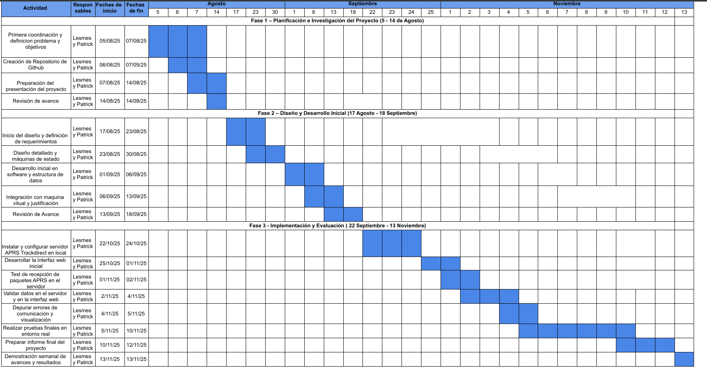


## 👥 Grupo de Trabajo  

Este grupo se enfoca en la configuración y gestión de un servidor local APRS Trackdirect.  

#### Responsabilidades principales:  
- Configuración del servidor en entorno local.  
- Integración con receptores APRS.  
- Visualización y análisis de tramas recibidas.  
- Documentación técnica de instalación y operación.  
- Mantenimiento y solución de problemas.  

---
## Vista Funcional: Diagrama de Secuencia
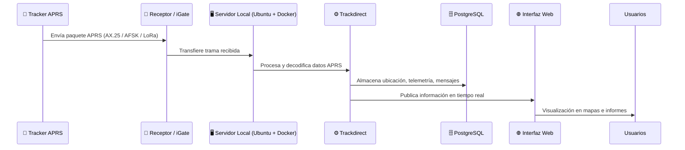

## ⚙️ Arquitectura del Servidor 
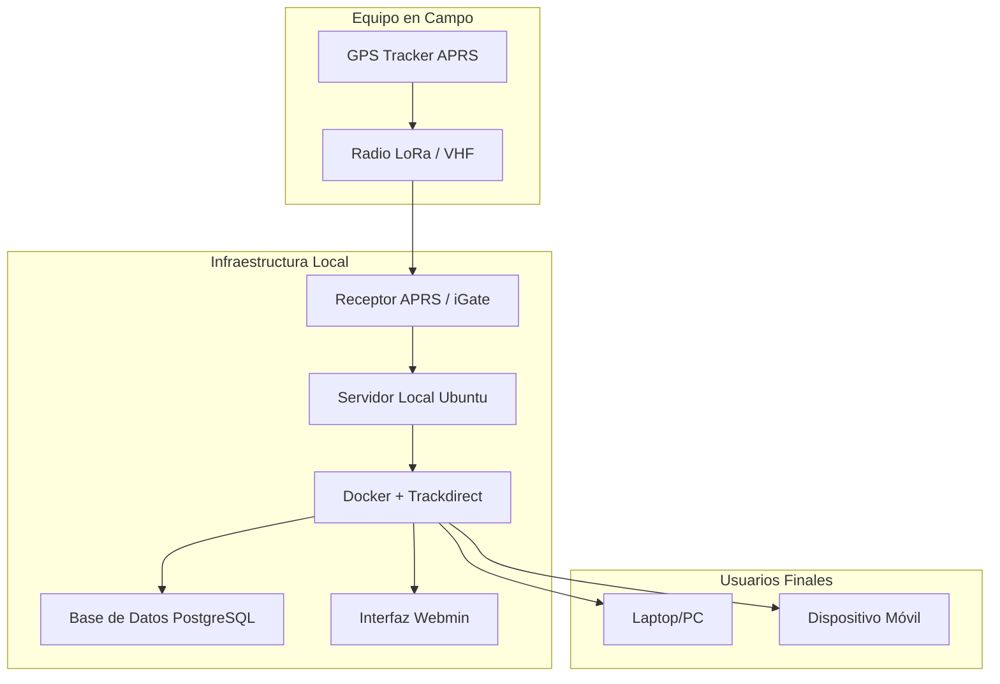

## ⚙️ Instalación y Configuración del Servidor 

### Pre-Requisitos
Como primeros pasos de configuración preliminar se debe:

- Configurar desde la Interfaz de UEFI/BIOS la opción de virtualización.

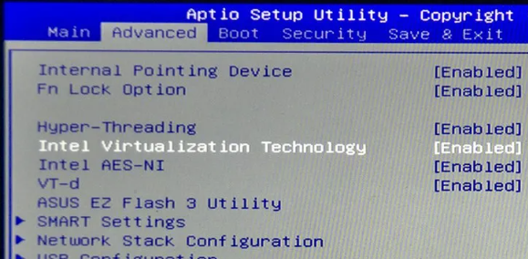

Además se deben descargar e instalar lo siguientes programas:

-  Ubuntu Server 
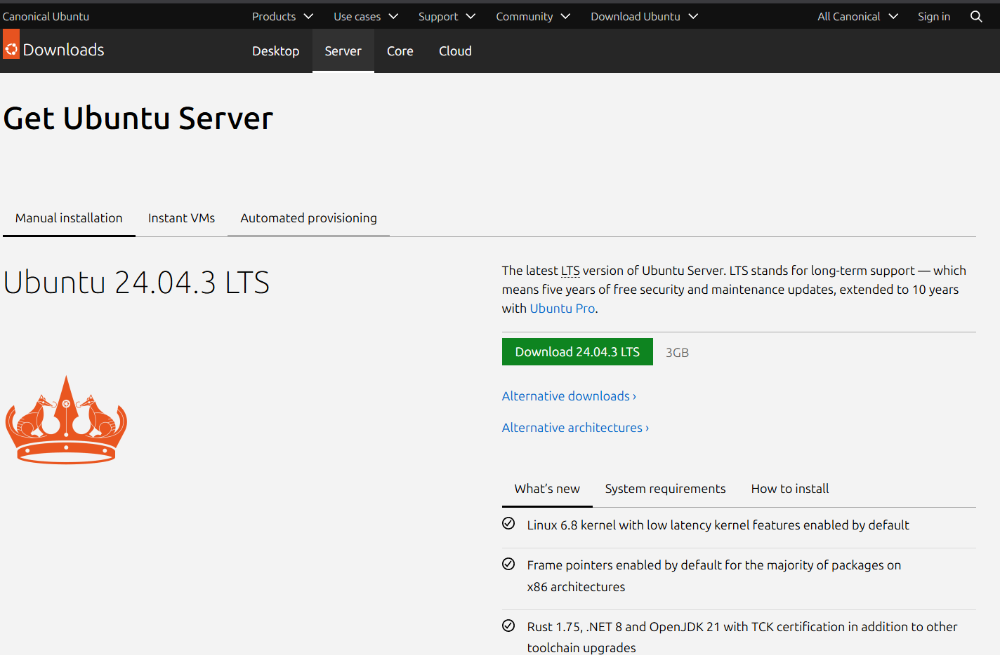

-  Virtual Box 
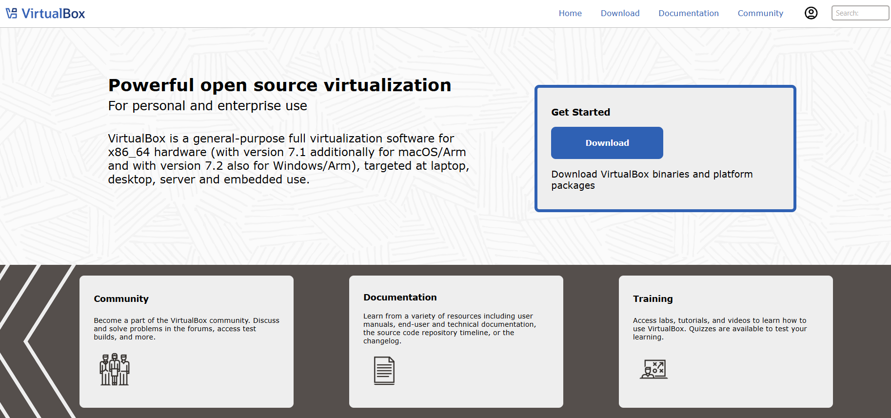

### Paso 1: Creación de Máquina Virtual

1) Primeramente, dentro de la aplicación de virtual Box se debe crear una nueva máquina virtual y se debe cargar la imagen ISO correspondiente.

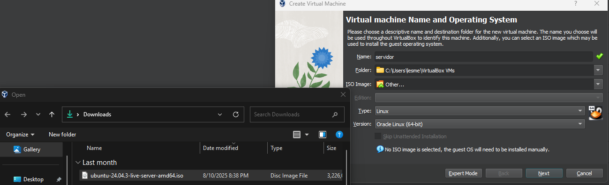

2. Los recursos disponibles dependen de cada sistema, pero siempre es recomendable elegir recursos moderados y recomendados para la aplicacion, se puede usar la barra verde de la interfaz como guía de asignación de los recursos. 

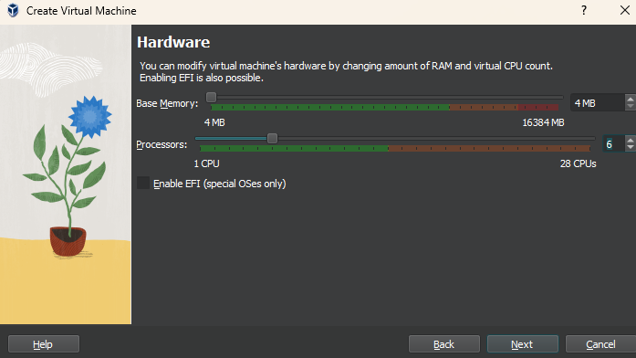

Una vez completada la asignación de recursos, se finaliza el proceso y la máquina virtual debe aparecer, dentro de la interfaz.

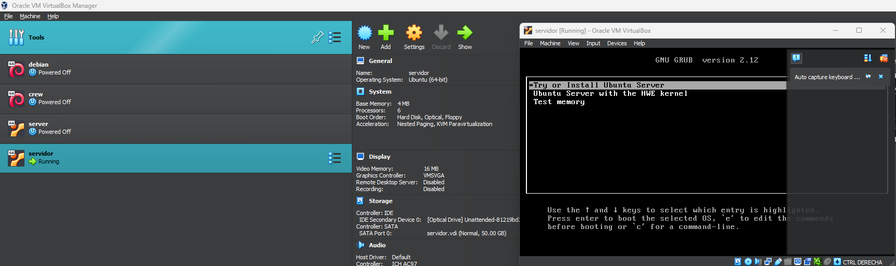

### Paso 2: Configuración para el Servidor
Para la configuración para convertir la máquina virtual en un servidor, se deben hacer alguna configuraciones iniciales.

1. Antes de arrancar la máquina se deben habilitar dos puertos de Red, uno de tipo red puente y otro de red interna, como se muestra en las siguientes Figuras.

###### Red Puente
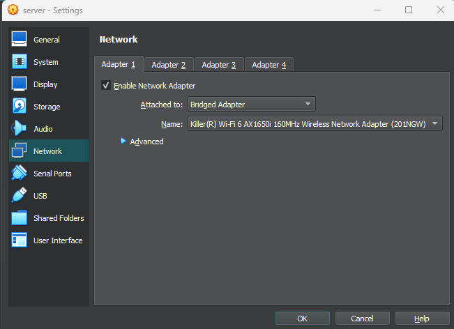

###### Red Interna
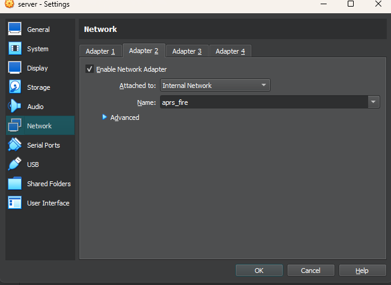

2. Luego se deben configurar aspectos como idioma y teclado. 
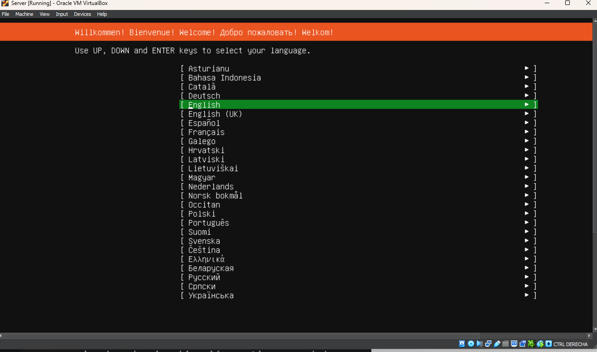

3. Se selecciona el tipo de instalación, para este caso Ubuntu Server por defecto.

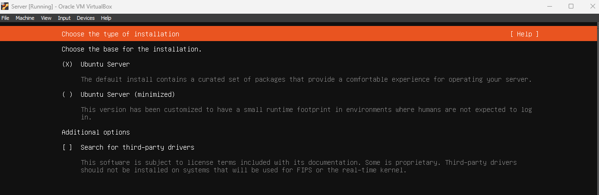

4. Se registra la configuración de red para su posterior uso, no se configura ninguna dirección proxy, se acepta la configuración de espejo de Ubuntu y se acepta la partición de disco por defecto.

5. Se rellenan los espacios de configuración de perfil, con los deseados.

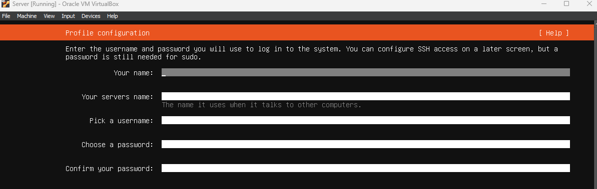

6. Se salta la configuración de Ubuntu-pro, la configuración de ssh se puede dejar para pasos posteriores, no se instalan ningun paquete de snap y se deja instalar la imagen y se reinicia la máquina. 

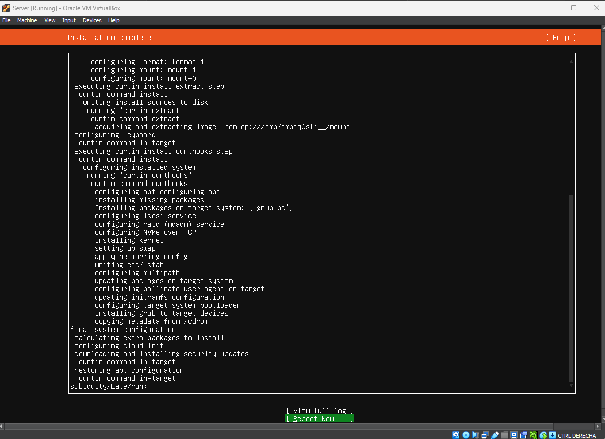

7. Se ingresa el usuario y contraseña para acceder a sistema operativo. 

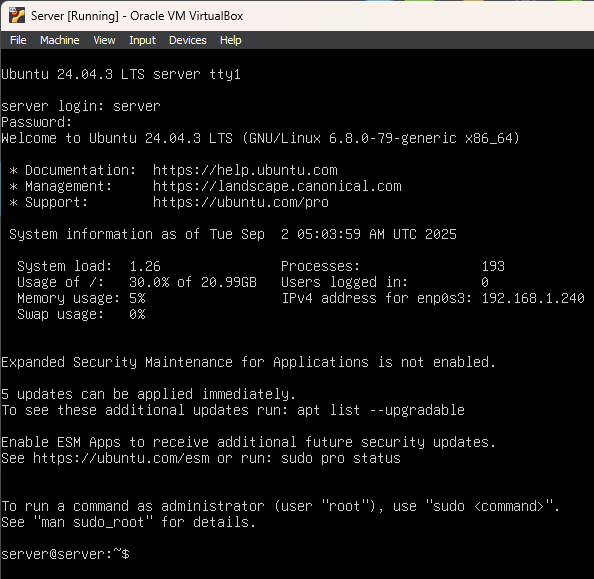


### Paso 3: Instalación Webmin

##### Paso 1: Descargar Webmin
1. Acceder a https://webmin.com/download/
2. Seguir los pasos de instalación proporcionados en la página

##### Paso 2: Verificar la Integridad de la Descarga
Para verificar que el paquete de Webmin se descargó correctamente:
```bash
sha256sum webmin-current.deb
```
Comparar el resultado con la verificación de checksum proporcionada en la página de descarga.

##### Paso 3: Instalar el Paquete de Webmin
Una vez verificada la descarga, proceder con la instalación:
```bash
dpkg -i webmin-current.deb
```

##### Paso 4: Solucionar Dependencias (si es necesario)
Si ocurren problemas de dependencias durante la instalación, resolverlos con:
```bash
sudo apt-get -f install
```

##### Paso 5: Acceder a la Interfaz Web de Webmin
1. Abrir el navegador web y navegar a:
   ```
   https://[ip-del-servidor]:10000
   ```
   Donde `[ip-del-servidor]` es la dirección IP mostrada para la segunda tarjeta de red virtual `enp0s3` (listada después de `inet`)

##### Paso 6: Iniciar Sesión
Ingresar las credenciales del servidor para acceder al panel de control de Webmin.

---

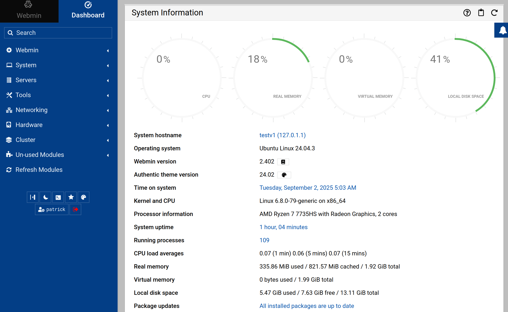

## ⚙️ Instalación y Configuración de APRS Trackdirect
Este apartado describe cómo instalar y configurar APRS Trackdirect en un servidor local Ubuntu.

#### 🔹 Pre-Requisitos

- Antes de iniciar la instalación:

  - Tener instalado Docker y Docker Compose.
Guía oficial de instalación de Docker: https://docs.docker.com/get-started/get-docker/


##### 🔹 Paso 1: Clonar el Repositorio
Clonar el repositorio de APRS Trackdirect: 
```bash
git clone https://github.com/tu_usuario/trackdirect.git
cd trackdirect
```

##### 🔹 Paso 2: Configurar Archivos
Editar los archivos de configuración según las necesidades del proyecto:
```bash
nano config/trackdirect.ini
nano config/aprsc.conf
nano config/postgresql.conf
```
##### 🔹 Paso 3: Iniciar la Aplicación con Docker Compose
Levantar los contenedores de Trackdirect:
```bash
docker compose up
```
Para ejecutar en segundo plano (daemon):
```bash
docker compose up -d
```
Verificar los logs:
```bash
docker compose logs -f
```

##### 🔹 Paso 4: Acceder a la Interfaz Web
Si la instalación fue correcta, abrir el navegador y acceder a la IP del servidor:
```bash
ip a 
```
Luego acceder usando la IP que aparece junto a inet:
```bash 
http://[IP_DEL_SERVIDOR]
```
- Asegurarse de que los paquetes APRS lleguen al servidor y confirmar que los datos se visualicen correctamente en la interfaz web.

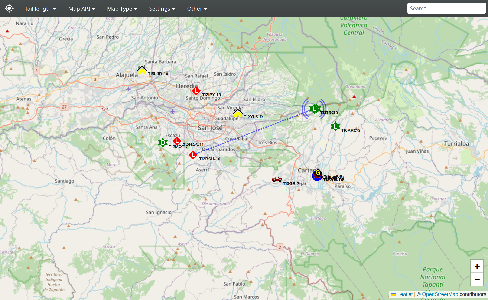

---

## 🧪 Pruebas y Verificación  

Esta sección describe las pruebas realizadas para validar el correcto funcionamiento del sistema de monitoreo local basado en **APRS Trackdirect**.  

### 🔹 Objetivo de las Pruebas  
Comprobar la correcta **recepción, decodificación, almacenamiento y visualización** de los paquetes APRS transmitidos desde dispositivos de campo (trackers o iGates) hacia el servidor local.

---

### 🔹 Escenario de Pruebas  
| Elemento | Descripción |
|-----------|-------------|
| **Entorno de servidor** | Ubuntu Server con Docker y Webmin |
| **Aplicación principal** | APRS Trackdirect |
| **Base de datos** | PostgreSQL |
| **Interfaz de administración** | Webmin |
| **Interfaz de visualización** | Panel web de Trackdirect |
| **Fuente de datos APRS** | Tracker LoRa o simulador APRS (paquetes AX.25) |

---

### 🔹 Prueba 1 – Recepción de Tramas APRS  
**Procedimiento:**
1. Configurar el transmisor APRS (tracker o simulador) con frecuencia y formato correctos.  
2. Enviar una trama de prueba con identificador único.  
3. Verificar que el receptor o iGate la reciba correctamente y la reenvíe al servidor local.  

**Criterio de éxito:**  
La trama aparece en los registros de Trackdirect (`docker compose logs`) y es decodificada sin errores.

---

### 🔹 Prueba 2 – Almacenamiento en Base de Datos

**Procedimiento:**
1. Verificar que el servicio de base de datos (PostgreSQL) esté en ejecución.  
2. Consultar la tabla correspondiente a las tramas APRS.  
3. Enviar una trama de prueba desde el transmisor o simulador.  
4. Confirmar que la trama se almacena con su hora, posición y metadatos.  

**Criterio de éxito:**  
La trama se registra correctamente en la base de datos y se puede consultar mediante una sentencia SQL básica.

---

### 🔹 Prueba 3 – Visualización Web en Tiempo Real
**Procedimiento:**
1. Abrir la interfaz web de Trackdirect.  
2. Transmitir una trama APRS desde el transmisor.  
3. Observar el mapa o panel de monitoreo para verificar la aparición del marcador.  
4. Revisar que los datos de ubicación y mensajes se actualicen correctamente.  

**Criterio de éxito:**  
La trama se visualiza en el panel web en tiempo real, con ubicación y datos correctos.

---

### 🔹 Prueba 4 – Operación sin Conexión a Internet
**Procedimiento:**
1. Desconectar temporalmente la conexión a Internet del servidor local.  
2. Transmitir nuevas tramas APRS desde el tracker o simulador.  
3. Verificar que las tramas se reciben, procesan y almacenan localmente.  
4. Reconectar Internet y comprobar que el sistema sincroniza correctamente los datos pendientes (si aplica).  

**Criterio de éxito:**  
El sistema mantiene la funcionalidad local sin pérdida de datos y sincroniza correctamente al restablecer la conexión.

---

### 🔹 Prueba 5 – Administración y Monitoreo con Webmin
**Procedimiento:**
1. Acceder a la interfaz de Webmin (https://[IP_DEL_SERVIDOR]:10000).  
2. Verificar el estado de los contenedores y servicios (Trackdirect, PostgreSQL, web server).  
3. Probar reiniciar o detener algún servicio desde Webmin.  
4. Confirmar que el sistema continúa funcionando correctamente tras la acción.  

**Criterio de éxito:**  
El sistema puede ser monitoreado y administrado completamente desde Webmin, sin necesidad de acceso por terminal.

---

## 🧱 Tareas de Fortalecimiento y Escalabilidad  

Para robustecer la seguridad, observabilidad y mantenibilidad del sistema, se han definido las siguientes tareas de mejora técnica:  

### 🔒 1. Hardening de Seguridad  
- Configurar y activar **UFW (Uncomplicated Firewall)** con reglas mínimas de entrada/salida.  
- Asegurar el acceso **SSH** mediante el uso exclusivo de **claves públicas** (deshabilitando autenticación por contraseña).  
- Restringir el acceso a los puertos de administración (Webmin, Grafana, Prometheus) únicamente desde redes confiables.  

---

### 📊 2. Observabilidad y Monitoreo  
- Instalar y configurar **Prometheus** como colector de métricas del sistema.  
- Integrar **Grafana** para la visualización en tiempo real de:  
  - Estado del servidor (CPU, RAM, uso de disco).  
  - Estadísticas de red APRS (paquetes recibidos, tramas decodificadas).  
- Crear un **dashboard de monitoreo** con alertas básicas configuradas (por ejemplo, uso de CPU > 80%).  

---

### ⚙️ 3. Automatización del Despliegue  
- Desarrollar un **script de provisionamiento** en **Ansible** o **Shell Bash** que automatice:  
  - Instalación de dependencias (Docker, Webmin, Trackdirect, Prometheus, Grafana).  
  - Configuración de red y servicios del servidor.  
  - Creación de usuarios, llaves SSH y reglas del firewall.  
- El objetivo es permitir la **replicación rápida y consistente** del entorno en nuevos servidores o equipos de respaldo.


---

## 📚 Referencias

- Adelantado, F., Vilajosana, X., Tuset-Peiró, P., Martínez, B., Melià-Segui, J., & Watteyne, T. (2017). Understanding the Limits of LoRaWAN. IEEE Communications Magazine, 55(9), 34–40.
https://arxiv.org/pdf/1607.08011 [arxiv.org]


- APRS Foundation Inc. (2025). APRS: Automatic Packet Reporting System. Sitio web histórico. Consultado el 12 agosto 2025.
https://www.aprsfoundation.org
Para información actualizada: https://how.aprs.works [aprsfoundation.org]


- Espressif Systems (2023). ESP32 Series Datasheet. Documento técnico. Consultado: 12 agosto 2025.
https://www.espressif.com/sites/default/files/documentation/esp32_datasheet_en.pdf [espressif.com]


- Semtech Corporation (2025). LoRa Technology Overview. Sitio web oficial. Consultado: 12 agosto 2025.
https://www.semtech.com/lora [semtech.com]


- Superintendencia de Telecomunicaciones de Costa Rica (SUTEL) (2023). Plan Nacional de Atribución de Frecuencias (PNAF), Reforma Integral. PDF, mayo 2023. Alcance N.º 99 a La Gaceta N.º 95, 30 mayo 2023.
https://www.sutel.go.cr/sites/default/files/normativas/plan_nacional_de_atribucion_de_frecuencias_pnaf_con_reforma.pdf [sutel.go.cr]